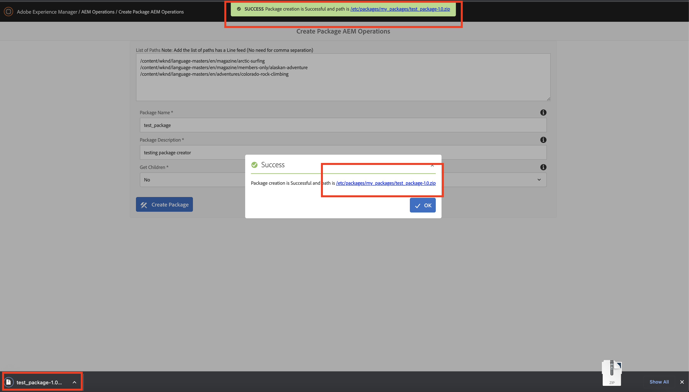
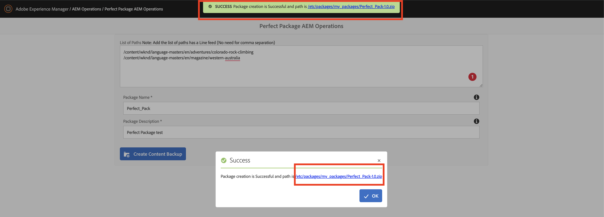
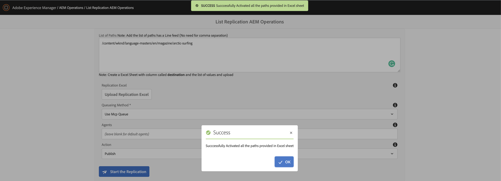
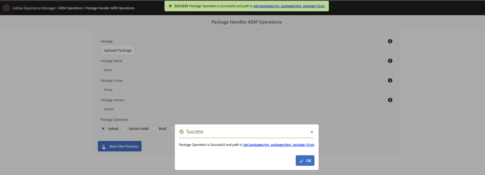

# AEM Operations Tools

AEM OOTB comes with multiple tools in AEM and to access all the tools you need to navigate to tool section and select the appropriate to sections to perform all the operations

For example:
1.	AEM operations
2.	Managing templates
3.	Cloud configurations
4.	ACS Commons tools etc..

Tools are essential part of AEM and avoids any dependency with Groovy scripts or any add scripts and can be managed or extended at any given point of time.

For more information visit my bog here :

## 1. Package Creator
   

## 2. Perfect Content Package
   

## 3. List Replication
   

## 4. Package Handler
   

## Modules

The main parts of the template are:

* core: Java bundle containing all core functionality like OSGi services, listeners or schedulers, as well as component-related Java code such as servlets or request filters.
* ui.apps: contains the /apps (and /etc) parts of the project, ie JS&CSS clientlibs, components, and templates
* ui.content: contains sample content using the components from the ui.apps
* all: a single content package that embeds all of the compiled modules (bundles and content packages) including any vendor dependencies
* analyse: this module runs analysis on the project which provides additional validation for deploying into AEMaaCS

## How to build

To build all the modules run in the project root directory the following command with Maven 3:

    mvn clean install

To build all the modules and deploy the `all` package to a local instance of AEM, run in the project root directory the following command:

    mvn clean install -PautoInstallSinglePackage

Or to deploy it to a publish instance, run

    mvn clean install -PautoInstallSinglePackagePublish

Or alternatively

    mvn clean install -PautoInstallSinglePackage -Daem.port=4503

Or to deploy only the bundle to the author, run

    mvn clean install -PautoInstallBundle

Or to deploy only a single content package, run in the sub-module directory (i.e `ui.apps`)

    mvn clean install -PautoInstallPackage
